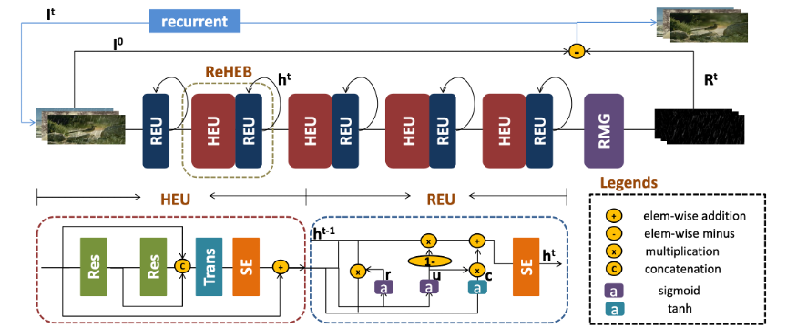

# Single Image Deraining via Recurrent Hierarchy Enhancement Network (ACM'MM19)
[[pdf](https://dl.acm.org/results.cfm?query=Single+Image+deraining+via+recurrent+hierarchy+enhancement+network&Go.x=0&Go.y=0)][[code](https://github.com/nnUyi/ReHEN)][[DerainZoo](https://github.com/nnUyi/DerainZoo)]

[Youzhao Yang](https://github.com/nnUyi), and [Hong Lu](http://homepage.fudan.edu.cn/honglu/); School of Computer Science, Fudan University

# Abstract
   Single image deraining is an important problem in many computer vision tasks since rain streaks can severely hamper and degrade the visibility of images. In this paper, we propose a novel network named Recurrent Hierarchy Enhancement Network (ReHEN) to remove rain streaks from rainy images stage by stage. Unlike previous deep convolutional network methods, we adopt a Hierarchy Enhancement Unit (HEU) to fully extract local hierarchical features and generate effective features. Then a Recurrent Enhancement Unit (REU) is added to keep the useful information from HEU and benefit the rain removal in the later stages. To focus on different scales, shapes, and densities of rain streaks adaptively, Squeeze-and-Excitation (SE) block is applied in both HEU and REU to assign different scale factors to high-level features. Experiments on five synthetic datasets and a real-world rainy image set show that the proposed method outperforms the state- of-the-art methods considerably. The source code is available at https://github.com/nnUyi/ReHEN .

<p align='center'></p>

# Dataset
## Synthetic Datasets
   | Datasets | #train | #test | label |
   | :------- | -----: | ----: | :-----: |
   | [Rain100L](https://github.com/nnUyi/DerainZoo) | 200    | 100   | rain mask & rain map|
   | [Rain100H](https://github.com/nnUyi/DerainZoo) | 1800   | 100   | rain mask & rain map|
   | [Rain800](https://github.com/nnUyi/DerainZoo)  | 700    | 100   | -     |
   | [Rain1200](https://github.com/nnUyi/DerainZoo) | 12000  | 1200  | rain density |
   | [Rain1400](https://github.com/nnUyi/DerainZoo) | 12600  | 1400  | - |
   
## Real-World Datasets
   | Datasets | #train | #test | label |
   | :------- | :-----: | ----: | :-----: |
   | [Real-World](https://github.com/nnUyi/DerainZoo) | - | 67 | - |

# Pre-trained Model
**We note that these models is trained on NVIDIA GeForce GTX1070:**

| Datasets | Pre-trained model |
| :------ | :--------------- |
| Rain100L | [Rain100L model](https://github.com/nnUyi/ReHEN/tree/master/codes/checkpoint/) |
| Rain100H | [Rain100H model](https://github.com/nnUyi/ReHEN/tree/master/codes/checkpoint/) |
| Rain800 | [Rain800 model TAB](https://github.com/nnUyi/ReHEN/tree/master/codes/checkpoint/) |
| Rain1200 | [Rain1200 model TAB](https://github.com/nnUyi/ReHEN/tree/master/codes/checkpoint/) |
| Rain1400 | [Rain1400 model TAB](https://github.com/nnUyi/ReHEN/tree/master/codes/checkpoint/) |

# Requirements
   - python 3.6.5
   - opencv 3.4.2
   - numpy 1.14.3
   - argparse 1.1
   - tensorflow_gpu >=1.4.0 & < 2.0

# Usages
   - **Clone this repo**
   ```
      $ git clone https://github.com/nnUyi/ReHEN
      $ cd ReHEN
      $ cd codes
   ```

   - **Train**
   ```
      $ CUDA_VISIBLE_DEVICES=0 python main.py --is_training True
                                              --train_dataset Rain100L
                                              --test_dataset Rain100L
                                              --trainset_size 200
                                              --testset_size 100
                                              --iterations 60000
                                              --lr 0.001
                                              --batch_size 32
   ```

   - **Test**
   ```
      $ CUDA_VISIBLE_DEVICES=0 python main.py --is_testing True
                                              --train_dataset Rain100L
                                              --test_dataset Rain100L
                                              --trainset_size 200
                                              --testset_size 100
                                              --batch_size 32
   ```
   
   - **Where should your datasets place?**
      - In the ***34rd and 35rd lines of settings.py***, you can see the --data_path and --test_path settings. You should download the datasets (or putting your own dataset) in the target path. And you should add your dataset format in ***train_dic & test_dic*** in the ***50th and 59th lines of settings.py***.

# Results
## Visualization of Hidden Statuses
   <div align="center">
      
   </div>
   
## Average PSNR and SSIM values on five synthetic datasets
   | Methods | -- | -- | Rain100L | Rain100H | Rain800 | Rain1200 | Rain1400 |
   | :-----: | :-----: | :-----: | :-----: | :----: | :-----: | :-----: | :-----: |
   | -- |  Params | Running Time (s) | PSNR/SSIM | PSNR/SSIM | PSNR/SSIM | PSNR/SSIM | PSNR/SSIM |
   | JORDER (CVPR'17)[1] | 369,792 | 0.268 | 36.11/0.970 | 22.15/0.674 | 22.24/0.776 | 24.32/0.862 | 27.55/0.853 |
   | DID-MDN (CVPR'18)[2] | 372,839 | 0.532 | 25.70/0.858 | 17.39/0.612 | 21.89/0.795 | 27.95/0.908 | 27.99/0.869 |
   | DualCNN (CVPR'18)[3] | 687,008 | 20.19 | 26.87/0.860 | 14.23/0.468 | 24.11/0.821 | 23.38/0.787 | 24.98/0.838 |
   | RESCAN (ECCV'18)[4] | 134,424 | 0.750 | 36.64/0.975 | 26.45/0.846 | 24.09/0.841 | 29.95/0.884 | 28.57/0.891 |
   | **OURS (ACMMM'19)** | 298,263 | 0.531 | **37.41/0.980** | **27.97/0.864** | **26.96/0.854** | **32.64/0.914** | **31.33/0.918** |
   
# References
[1] Wenhan Yang, Robby T. Tan, Jiashi Feng, Jiaying Liu, Zongming Guo, and Shuicheng Yan, “Deep joint rain detection and removal from a single image,” in Proceedings of the IEEE Conference on Computer Vision and Pattern Recognition, 2017, pp. 1357–1366.

[2] He Zhang and Vishal M. Patel, “Density-aware single image deraining using a multi-stream dense network,” in The IEEE Conference on Computer Vision and Pattern Recognition, 2018, pp. 695–704.

[3] Jinshan Pan, Sifei Liu, Deqing Sun, Jiawei Zhang, Yang Liu, Jimmy Ren, Zechao Li, Jinhui Tang, Huchuan Lu, and Yu-Wing Tai, “Learning dual convolutional neural networks for low-level vision,” in Proceedings of the IEEE Conference on Computer Vision and Pattern Recognition, 2018, pp. 3070–3079.

[4] Xia Li, Jianlong Wu, Zhouchen Lin, Hong Liu, and Hongbin Zha, “Recurrent squeeze-and-excitation context aggregation net for single image deraining,” in The European Conference on Computer Vision (ECCV), 2018, pp. 262–277.

# Acknowledgements
   - This work was supported in part by National Natural Science Foundation of China (No. U1509206).

# Citation
**If you find the resource useful, please cite the following:**
```
   @inproceedings{yang2019single,
      title={Single Image Deraining via Recurrent Hierarchy Enhancement Network},
      author={Yang, Youzhao and Lu, Hong},   
      booktitle={ACM International Conference on Multimedia (ACM'MM)},
      year={2019}
   }
```
